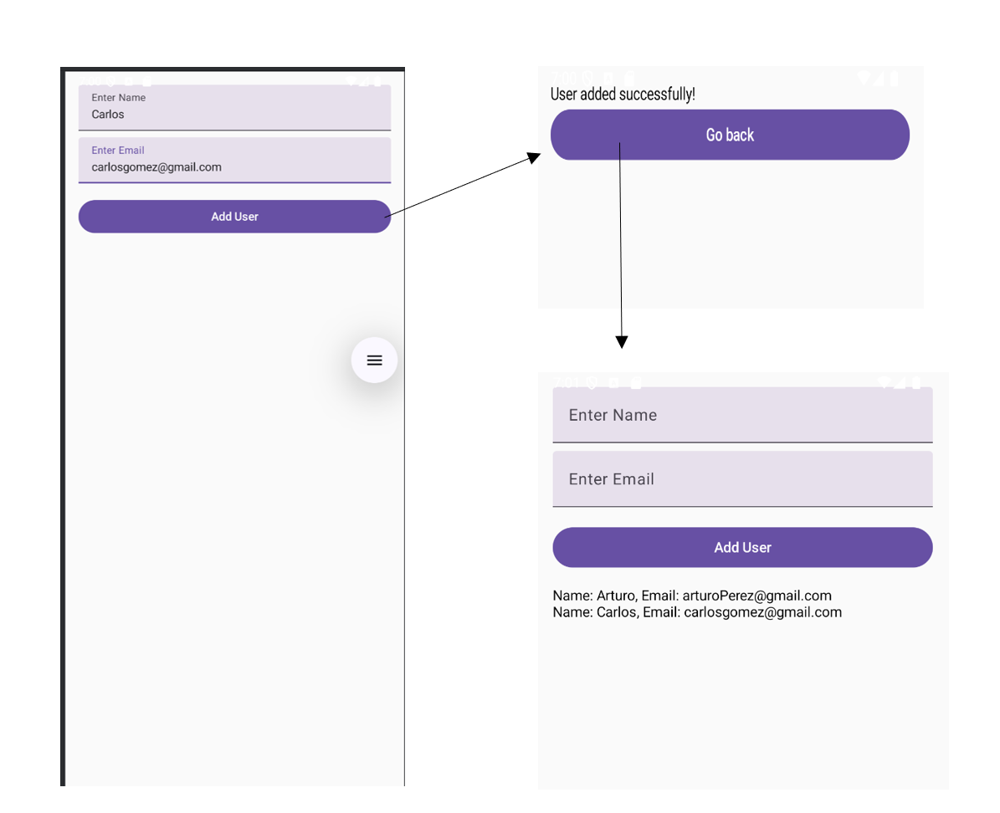
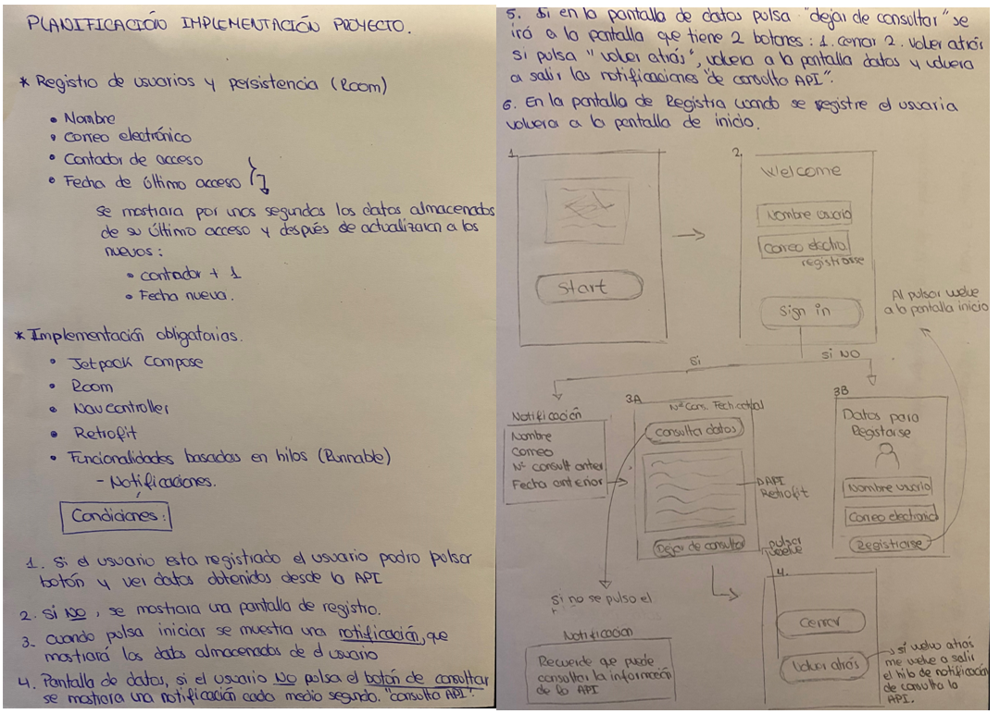
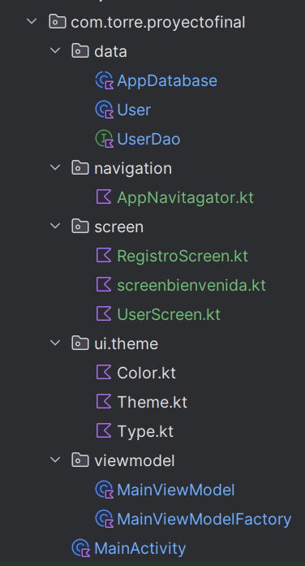
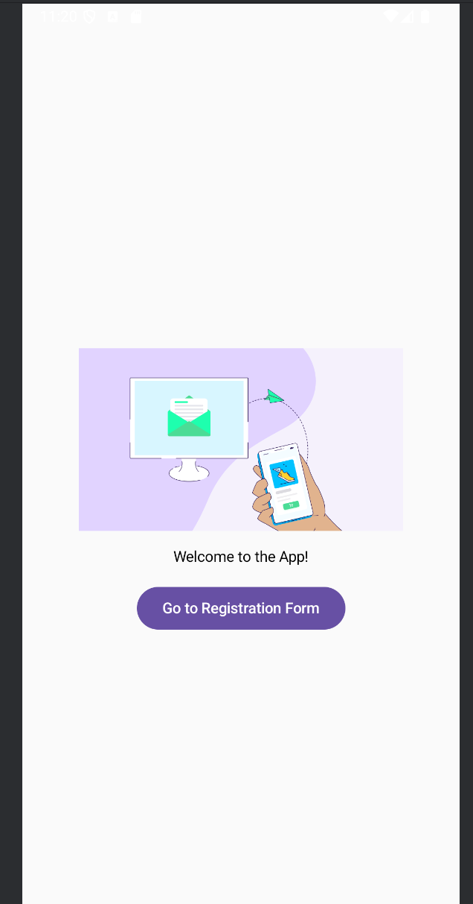

# DOCUMENTACIÓN Y SEGUIMIENTO - PROYECTO FINAL

## Descripción 

## DESCRIPCIÓN DE LAS FUNCIONALIDADES DE LA APLICACIÓN 


# SEGUIMIENTO DE LOS COMMIT

## 1 y 2 Commit: J.Compose + Room | J.Compose + Room + NavController

El proyecto se empieza con un enfoque de investigación y aclaración de conceptos, en el funcionamiento 
de las implementaciones que se piden para complementar el proyecto en su finalización.

### Implementación de librerías, versiones y dependencias
    
Se comienza con la configuración de versiones y dependencias esenciales para la 
utilización de: Retrofit, Room, Jetpack Compose y NavController.

Por ejemplo en mi proyecto tengo esto en: 

```build.gradle.kts 
plugins {
    // Se aplican los plugins necesarios para el proyecto
    alias(libs.plugins.android.application) // Plugin para una aplicación Android
    alias(libs.plugins.kotlin.android) // Plugin para habilitar Kotlin en Android
    id("kotlin-kapt") // Plugin para habilitar Kotlin Annotation Processing Tool (KAPT)
}

android {
    // Configuración general del proyecto Android
    namespace = "com.torre.proyectofinal" // Espacio de nombres para el proyecto
    compileSdk = 35 // Versión del SDK que se utilizará para compilar el proyecto

    defaultConfig {
        // Configuración predeterminada para la aplicación
        applicationId = "com.torre.proyectofinal" // Identificador único de la aplicación
        minSdk = 26 // Versión mínima de Android requerida
        targetSdk = 35 // Versión del SDK con la que se ha probado la aplicación
        versionCode = 1 // Código de versión para el control de actualizaciones
        versionName = "1.0" // Nombre de la versión de la aplicación

        testInstrumentationRunner = "androidx.test.runner.AndroidJUnitRunner" // Runner para pruebas 
        vectorDrawables {
            useSupportLibrary = true // Habilita el uso de la librería de soporte para vectores
        }
    }

    buildTypes {
        // Tipos de compilación, como Debug o Release
        release {
            isMinifyEnabled = false // No se habilita la minimización del código en la versión release
            proguardFiles(
                getDefaultProguardFile("proguard-android-optimize.txt"), // Archivo Proguard predet.
                "proguard-rules.pro" // Archivo Proguard adicional para reglas personalizadas
            )
        }
    }

    compileOptions {
        // Configura las opciones de compatibilidad para la compilación
        sourceCompatibility = JavaVersion.VERSION_1_8 // Compatibilidad con Java 8
        targetCompatibility = JavaVersion.VERSION_1_8 // Compatibilidad con Java 8
    }

    kotlinOptions {
        // Configuración de las opciones de Kotlin
        jvmTarget = "1.8" // Objetivo de la JVM, se utiliza Kotlin 1.8
    }

    buildFeatures {
        // Habilita características adicionales para el proyecto
        compose = true // Habilita Jetpack Compose para la UI
    }

    composeOptions {
        // Configuración adicional para Jetpack Compose
        kotlinCompilerExtensionVersion = "1.5.1" // Versión del compilador de extensión para Compose
    }

    packaging {
        // Configuración de empaquetado de recursos
        resources {
            excludes += "/META-INF/{AL2.0,LGPL2.1}" // Excluye ciertas licencias de recursos
        }
    }
}

dependencies {
    // Dependencias principales de Jetpack y AndroidX
    implementation(libs.androidx.core.ktx) // Librería que agrega funcionalidades de extensión para la API de Android
    implementation(libs.androidx.lifecycle.runtime.ktx) // Librería que extiende la API de Lifecycle para Kotlin
    implementation(libs.androidx.activity.compose) // Soporte para integrar Compose con actividades de Android
    implementation(platform(libs.androidx.compose.bom)) // BOM (Bill of Materials) para las dependencias de Compose
    implementation(libs.androidx.ui) // Dependencia principal de Jetpack Compose UI
    implementation(libs.androidx.ui.graphics) // Dependencia para gráficos en Compose
    implementation(libs.androidx.ui.tooling.preview) // Herramientas para previsualizar UI en Compose
    implementation(libs.androidx.material3) // Material Design 3 para Compose

    // Dependencias de Room (Base de datos)
    implementation(libs.androidx.room.runtime) // Librería principal para usar Room
    implementation(libs.androidx.navigation.compose) // Librería para navegación con Compose
    implementation(libs.androidx.runtime.livedata) // Soporte para LiveData en Room
    //implementation(libs.androidx.ui.test.android) // (Comentada) Dependencia para pruebas de UI en Android
    kapt(libs.androidx.room.compiler) // Procesador de anotaciones para Room (KAPT)
    implementation("androidx.room:room-ktx:2.5.2") // KTX para Room, proporciona extensiones para Room en Kotlin

    // Dependencias de Coroutines (para operaciones asincrónicas)
    implementation(libs.kotlinx.coroutines.core) // Coroutines Core, para operaciones asincrónicas generales
    implementation(libs.kotlinx.coroutines.android) // Coroutines Android, extensión para trabajar en el hilo principal

    // Dependencias de Lifecycle (para gestionar ciclo de vida y datos en la UI)
    implementation(libs.androidx.lifecycle.viewmodel.ktx) // KTX para ViewModel, que ayuda a gestionar el ciclo de vida
    implementation(libs.androidx.lifecycle.livedata.ktx) // KTX para LiveData, para gestionar datos reactivos

    // Dependencias para pruebas unitarias y de UI
    testImplementation(libs.junit) // Dependencia para pruebas unitarias con JUnit
    androidTestImplementation(libs.androidx.junit) // Dependencia para pruebas instrumentadas con JUnit
    androidTestImplementation(libs.androidx.espresso.core) // Dependencia para pruebas de UI con Espresso

    // Dependencias adicionales para pruebas de Compose
    androidTestImplementation(platform(libs.androidx.compose.bom)) // BOM para pruebas con Compose

    //Dependencias habilitadas por imposibilidad de versión
    //androidTestImplementation(libs.androidx.ui.test.junit4) // (Comentada) Dependencia para pruebas de UI en Compose
    //debugImplementation(libs.androidx.ui.tooling) // (Comentada) Herramientas de depuración para Compose
    //debugImplementation(libs.androidx.ui.test.manifest) // (Comentada) Manifesto de prueba para Compose
}

kapt {
    correctErrorTypes = true // Configura KAPT para corregir tipos de error en la anotación
}
```

La elección de las librerías y dependencias dependerá del tipo de proyecto y las funcionalidades
que se implementen, pero configurar correctamente las versiones y dependencias es un paso 
fundamental para garantizar el correcto funcionamiento del proyecto.

### Investigación previa sobre el funcionamiento de Jetpack Compose + Room + NavController

##### Jetpack Compose
Jetpack Compose es un framework moderno para construir interfaces de usuario en Android de manera
declarativa. En lugar de utilizar XML, Compose permite construir la UI directamente en código
mediante anotaciones @Composable, lo que simplifica la creación y gestión de interfaces.

Jetpack Compose vs Forma Tradicional de Crear Interfaces

Una diferencia clave con la forma tradicional de crear interfaces (usando XML y un patrón como 
MVVM) es que, en Jetpack Compose, la UI se define completamente en el código Kotlin. Esto hace 
que el proceso sea más ágil y fluido, sin necesidad de gestionar archivos XML, facilitando la 
modularidad y reutilización del código.

Conclusión:

Tras investigar y aplicar Jetpack Compose, concluyo que esta metodología es más eficiente y
controlada en comparación con el enfoque tradicional. Además, facilita la creación de interfaces 
más limpias y escalables.

##### Room

Room es una librería de persistencia de datos en Android que proporciona una abstracción sobre
SQLite. Facilita la creación de bases de datos locales utilizando objetos Kotlin y maneja
automáticamente las operaciones SQL.

 * Clases implementadas:

      - AppDatabase: Es una clase abstracta que extiende RoomDatabase y actúa como el punto de 
        acceso principal a la base de datos. Define las entidades (tablas) de la base de datos y
        proporciona acceso a los DAOs correspondientes.

      - UserDao: Es una interfaz que define las operaciones de acceso a los datos en la base de
        datos (como insertar, eliminar, modificar y consultar).

      - User: Es una clase de datos (data class) que define la estructura de la base de datos.
        Está anotada con @Entity, lo que indica que es una tabla en la base de datos.

##### NavController

NavController es un componente de Jetpack Navigation que facilita la gestión de la navegación entre
pantallas (fragments) en una aplicación. Utiliza un archivo de navegación (nav_graph) para
definir los destinos y las acciones de navegación.

      - NavGraph: Es un grafo que contiene los destinos y las acciones de navegación entre ellos.

Conclusión:

La implementación de NavController mejora la gestión de la navegación, ya que elimina la necesidad 
de declarar explícitamente las pantallas en el AndroidManifest.xml. Además, facilita el control de 
las transiciones entre pantallas y permite manejar la navegación de manera más flexible y modular.


##### Retrofit

Es una librería cliente HTTP para Android y Java que facilita la conexión a APIs RESTful, 
permitiendo realizar peticiones HTTP (GET, POST, PUT, DELETE) y obtener respuestas de forma
fácil, serializando automáticamente los datos JSON a objetos Java/Kotlin.



## Examinación de los requisitos del proyecto y planificación de sus requisitos 




## 3 Commit: Inicio de implementacion de la estructura planificada :
##           Restructuración de proyecto y creación de pantalla de Bienvenida

### 1. Restructuración de orden de clases del proyecto



Una vez estudiados los puntos clave del proyecto y las implementaciones necesarias, se toma la 
decisión de reestructurar la organización del mismo, implementando los siguientes cambios:

    1. Clase NavController:
        Esta clase se encargará de gestionar la navegación entre las diferentes pantallas del proyecto. 
        Su objetivo es centralizar el control de la navegación, lo que permite tener una organización más
        controlada y limpia. Esto es importante, ya que el proyecto involucra la implementación
        de varias pantallas con diversas relaciones entre ellas.
    2. Clases separadas para cada pantalla:
        Con el objetivo de garantizar la modularidad y escalabilidad del proyecto a largo plazo,
        se ha decidido crear una clase para cada pantalla, permitiendo gestionar las 
        pantallas de manera más independiente, facilitando su mantenimiento, cambios y la 
        implementación de nuevas funcionalidades o pantallas en el futuro.

### 2. Creación de pantalla de bienvenida

La implementación de la pantalla de bienvenida, tras la reestructuración de la organización del 
proyecto, no presentó demasiada complicación. El proceso fue directo, ya que se tenía claro el 
lugar donde se debía establecer la implementación de la interfaz de usuario (UI). En el
MainActivity, simplemente se realizó una referencia para llamar a esta pantalla.

 * Funcionalidad más relevante 

     ```Botón para navegar a la siguiente pantalla
        Button(
            onClick = {  // La acción que se ejecuta cuando el botón es presionado
                // Cuando el botón es presionado, navegamos a la pantalla del formulario
                AppNavigator.navigateToBienvenida(navController)  // Llama al método de navegación 'navigateToBienvenida' de AppNavigator
            }
        ) 
     ```
    !Al tener la navegación entre las pantallas centralizado en la clase AppNavigator, solo hay que 
    llamar a la función de la clase que indique la pantalla que se quiero ir ¡¡¡
          


## 4 Commit: Cambios UI de la pantalla de Inicio y establecimiento de condiciones de navegación 
##         entre pantallas: Modificación UI Inicio | implantación de condiciones de navegación 

 * Funcionalidad más relevantes

    ```Botón de validación entre pantallas
        Button(
            onClick = {
                if (name.value.isBlank() || email.value.isBlank()) {
                    errorMessage.value = "Ambos campos son obligatorios."
                } else {
                    errorMessage.value = ""
                    userViewModel.getUserByEmail(email.value) { user ->
                        if (user != null) {
                            navigateToConsultaUser(navController, user)

                        } else {
                            navigateToRegistroUser(navController)
                        }
                    }
                }
            },
            modifier = Modifier.fillMaxWidth()
        ) {
            Text("Consultar Usuario")
        }
     ```
    - !Las condiciónes para la navegacion entre pantallas se decidio resolver con un if 
     ya que las condiciones de la navegación era clara: 
        * Si : los datos introducidos coincidian con los datos de la BBDD se va a la pantalla de Consula
        * Sino : se va a la pantalla de registro

    - La consulta a la BBDD se hizo a trávez de una query en la clase UserData , que en la encargada
      de comunicarse con la BBDD
   
    ```@Query("SELECT * FROM user WHERE email = :email LIMIT 1")
        suspend fun getUserByEmail(email: String): User?
    ```

## 5 Modificación UI Registro 

